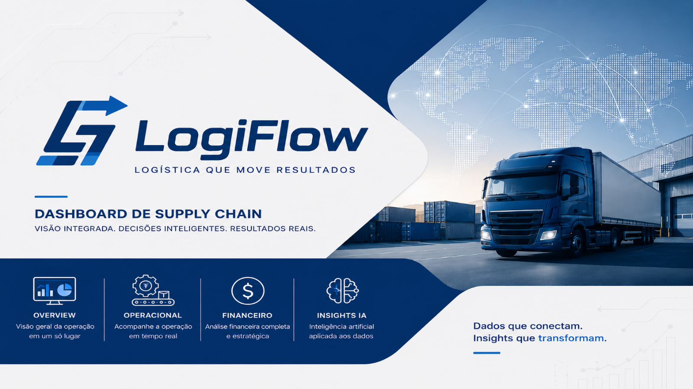

# Portfólio de BI · Série LogiFlow

Série de dashboards em **Power BI**, **DAX** e visuais personalizados em HTML/JavaScript, com análise por IA, construídos sobre uma mesma empresa fictícia, a **LogiFlow**, olhando para setores diferentes do negócio.

O objetivo é mostrar versatilidade na construção de indicadores: cada projeto parte das perguntas de um setor, do modelo de dados à visualização.

**Flávio Bueno** · [LinkedIn](https://www.linkedin.com/in/flaviobuenodados)

> ⚠️ Todos os projetos usam **dados fictícios**, criados para fins de portfólio.

---

## Projetos

### 1. [People Analytics](logiflow-people-analytics) · Gestão de Pessoas

Visão geral, turnover, desempenho, remuneração, eNPS e clima, com **Insights IA** e **Painel do Colaborador**.

📄 [Ver relatório em PDF](logiflow-people-analytics/BI_LogiFlow_People_Analytics.pdf)

---

### 2. [Supply Chain](logiflow-supply-chain) · Logística

OTIF, custo por entrega, SLA, cancelamentos, desempenho por transportadora e região, com **Insights IA**.

📄 [Ver relatório em PDF](logiflow-supply-chain/BI_LogiFlow_Supply_Chain.pdf)

---

## Stack

Power BI · DAX · Modelagem dimensional · HTML/CSS/JavaScript · Netlify Functions · IA generativa

## Em breve

Novos setores da LogiFlow serão adicionados à série.
