# LogiFlow · People Analytics

BI de gestão de pessoas construído em **Power BI**, com visuais HTML/JavaScript sob medida e análise por IA integrada ao relatório.

> ⚠️ **Todos os dados são fictícios**, criados para este projeto. A empresa LogiFlow não existe.

> 🧩 **Parte da série LogiFlow:** a mesma empresa fictícia analisada por diferentes setores. Veja também o [Supply Chain](../logiflow-supply-chain).

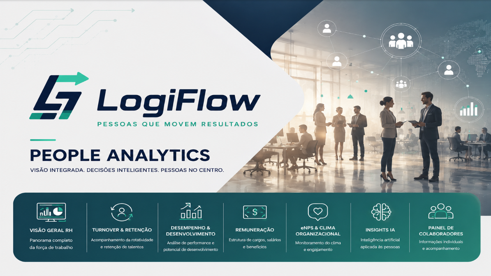

📄 **Relatório completo em PDF:** [BI_LogiFlow_People_Analytics.pdf](BI_LogiFlow_People_Analytics.pdf)

---

## O que o relatório responde

| Página | Foco |
|---|---|
| **Visão Geral RH** | Headcount, turnover, absenteísmo, tempo médio de casa e eNPS |
| **Turnover & Retenção** | Quem sai, de onde, voluntário x involuntário e tempo até o desligamento |
| **Desempenho & Desenvolvimento** | Nota de desempenho e potencial, treinamentos e top colaboradores |
| **Remuneração** | Folha, salário médio por nível, compa-ratio e % abaixo da faixa |
| **eNPS & Clima** | eNPS por geração, departamento e trimestre, com zona de classificação |
| **Insights IA** | Indicadores globais, mapa de calor de absenteísmo e perguntas em linguagem natural sobre os dados |
| **Painel de Colaboradores** | Ficha individual com score, status, plano de ação recomendado e análise por IA |

## Destaques

### Insights IA
Card interativo: o usuário escolhe um tema (resumo, turnover, eNPS, departamentos, ações) ou faz sua própria pergunta, e a resposta é gerada por IA a partir dos indicadores do relatório.

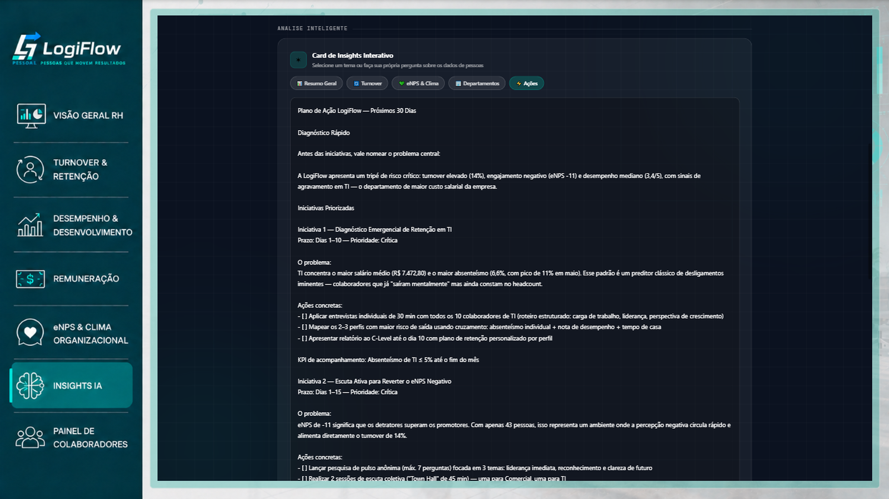

### Painel do Colaborador
Selecionando uma pessoa na lista, o painel mostra score RH, status, informações, plano de ação e uma análise por IA com foco em resumo, riscos, desenvolvimento, retenção e orientação para o gestor.

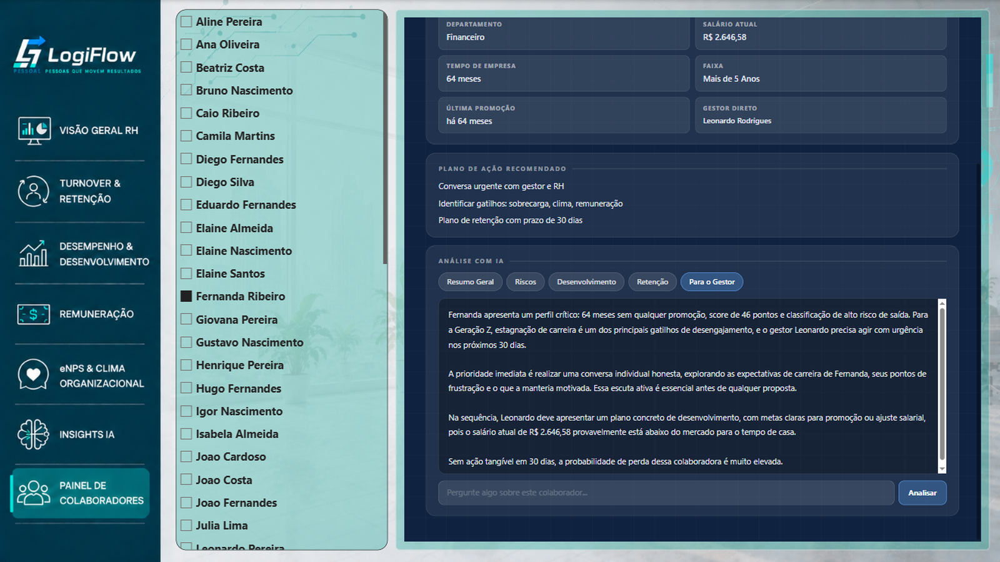

> O score e o status do painel seguem uma **regra ilustrativa** (tempo de casa e tempo desde a última promoção), criada para demonstrar a solução.

## Todas as páginas

| | |
|---|---|
| 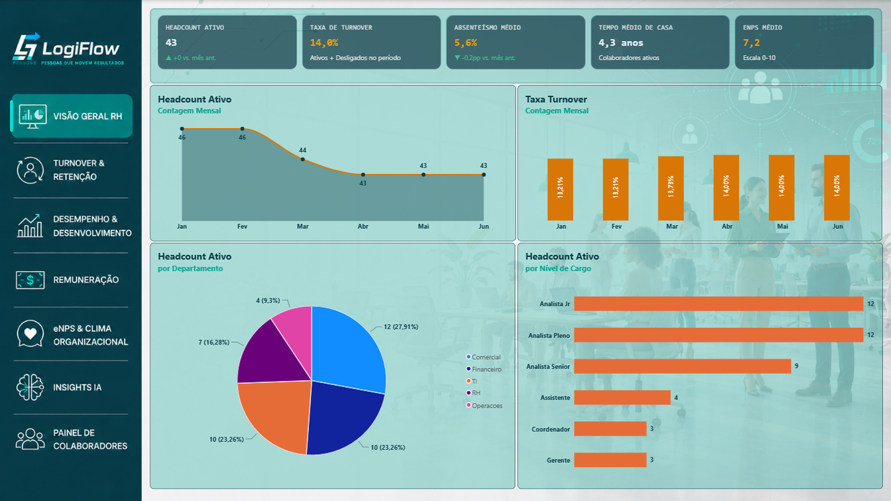 | 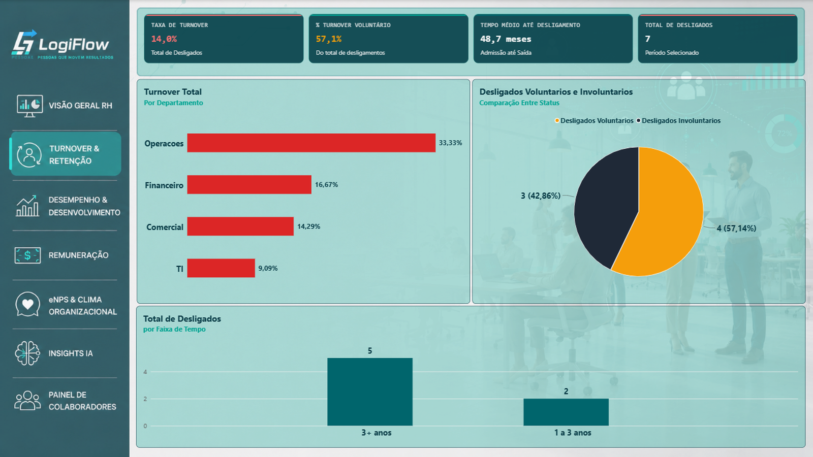 |
| 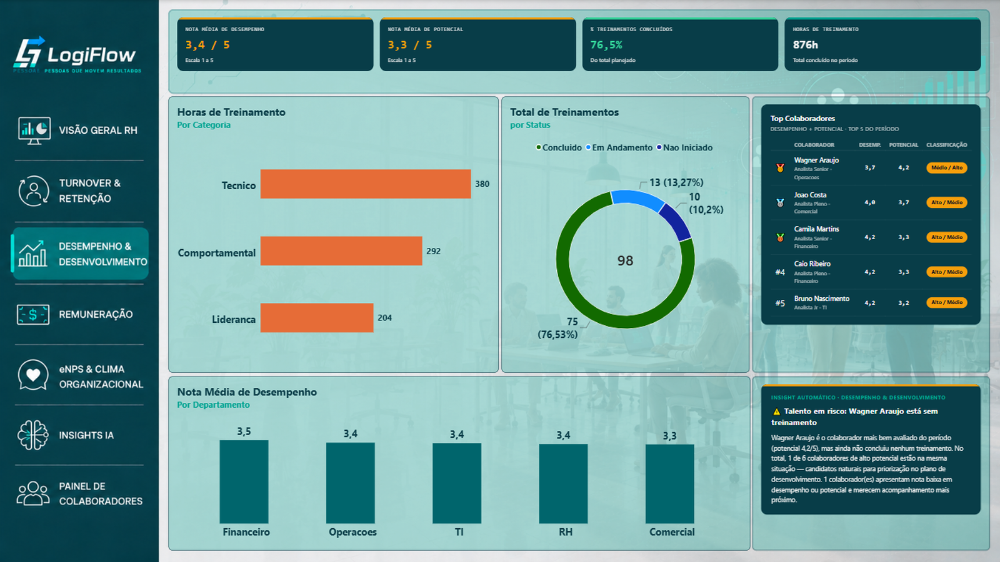 | 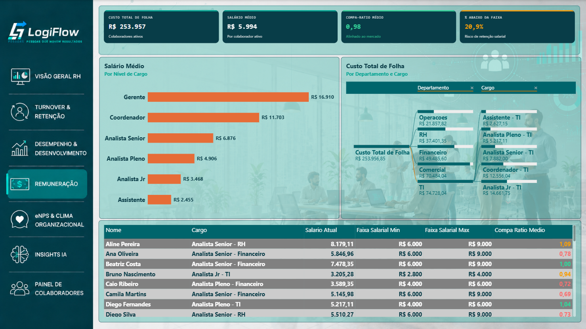 |
| 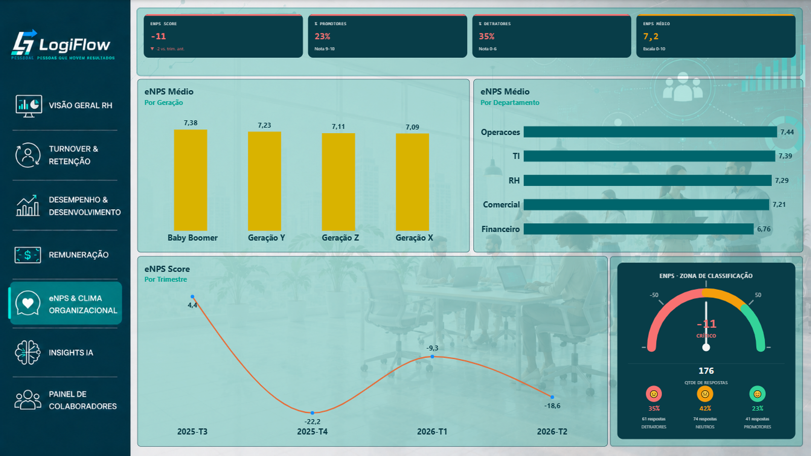 | 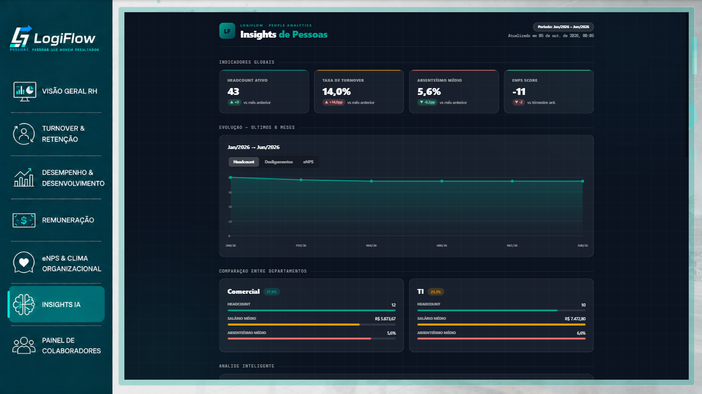 |
| 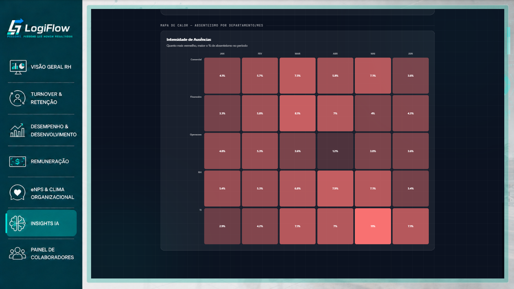 | 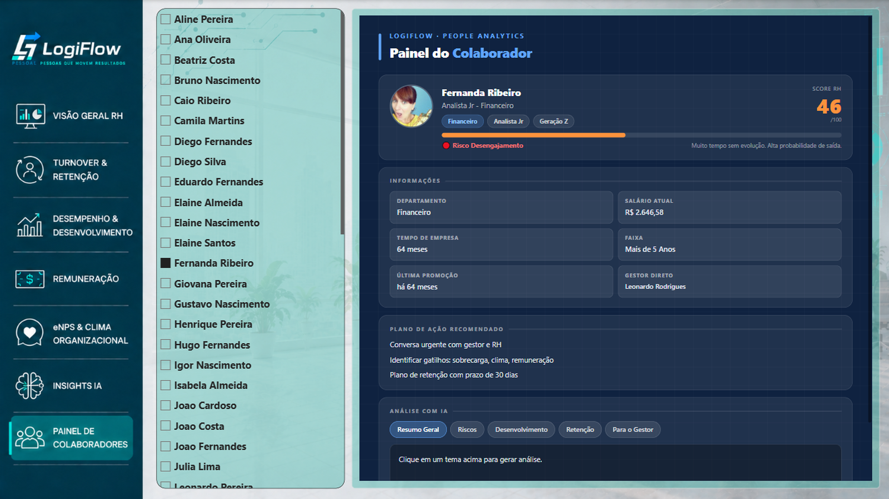 |

## Como foi construído

- **Power BI Desktop** e **DAX** para o modelo, medidas e indicadores
- **Visuais HTML/CSS/JavaScript** gerados por medidas DAX (Insights IA e Painel do Colaborador)
- **Função serverless (Netlify Functions)** que recebe o contexto do relatório e devolve a análise gerada por IA
- **Modelo dimensional** com dimensão de colaboradores e tempo e fatos de absenteísmo, clima, desempenho e treinamentos

## Observações

- O arquivo `.pbix` não é publicado neste repositório, pois as medidas dos visuais com IA apontam para uma função com credenciais privadas.
- Projeto de portfólio, sem relação com nenhuma empresa real.
