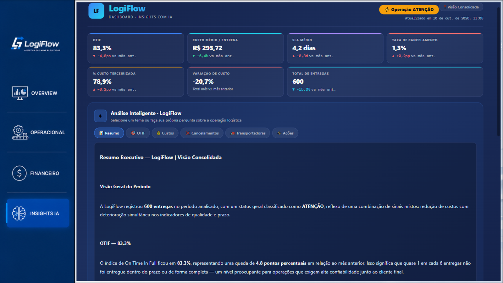
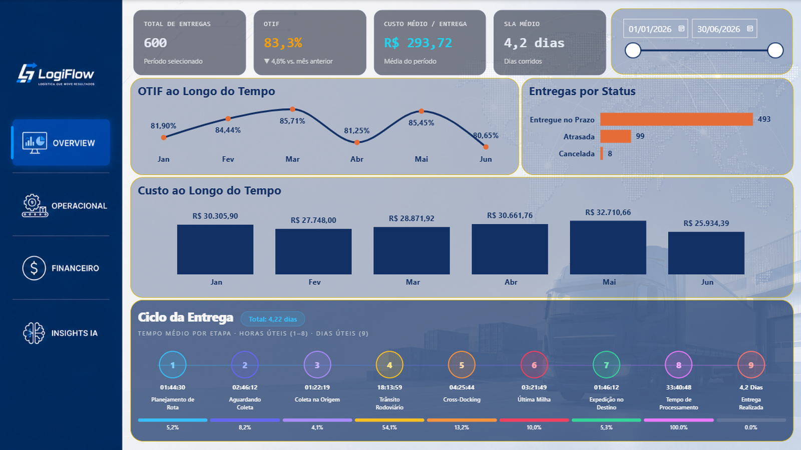
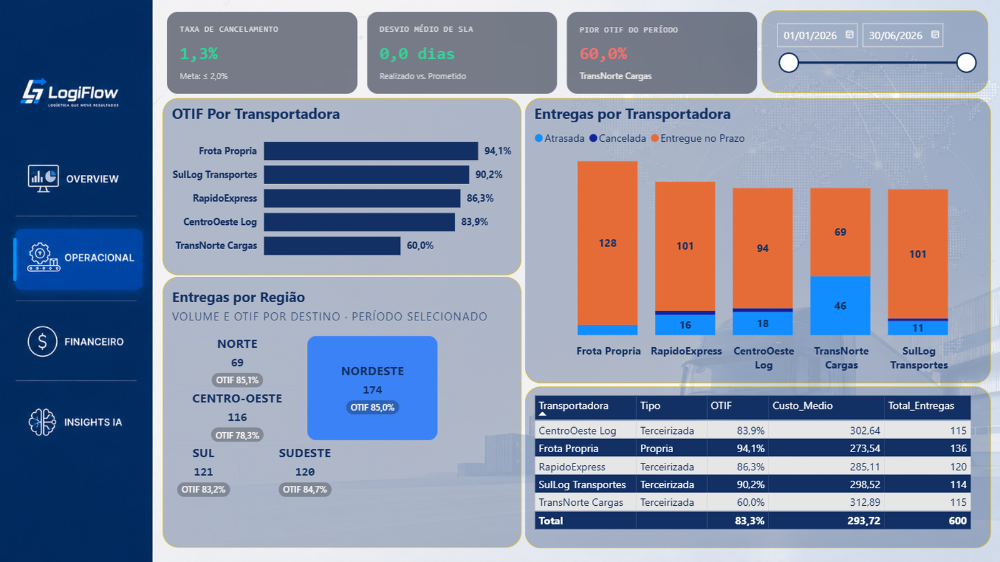
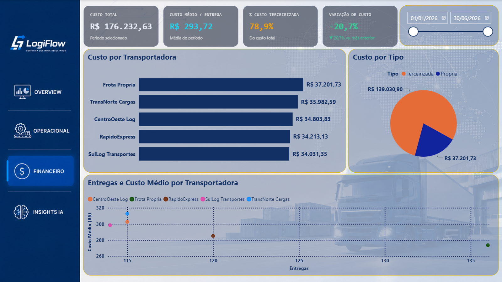
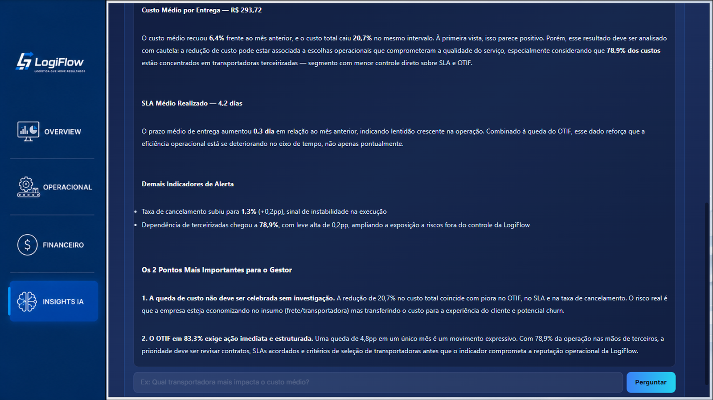

# LogiFlow · Supply Chain

Dashboard de logística e supply chain construído em **Power BI**, com visuais HTML/JavaScript sob medida e análise por IA integrada ao relatório.

> 🧩 **Parte da série LogiFlow:** a mesma empresa fictícia analisada por diferentes setores. Veja também o [People Analytics](../logiflow-people-analytics).
>
> ⚠️ **Todos os dados são fictícios**, criados para este projeto. A empresa LogiFlow não existe.

📄 **Relatório completo em PDF:** [BI_LogiFlow_Supply_Chain.pdf](BI_LogiFlow_Supply_Chain.pdf)

---

## O que o relatório responde

| Página | Foco |
|---|---|
| **Overview** | Total de entregas, OTIF, custo médio por entrega, SLA médio, evolução mensal e ciclo da entrega etapa por etapa |
| **Operacional** | Cancelamentos, desvio de SLA, pior OTIF, desempenho por transportadora e volume por região de destino |
| **Financeiro** | Custo total, custo por transportadora e por tipo (própria x terceirizada), % de custo terceirizado e variação de custo |
| **Insights IA** | KPIs consolidados com variação sobre o mês anterior e análise por IA com resumo, OTIF, custos, cancelamentos, transportadoras e plano de ação |

## Indicadores

- **OTIF** (On Time In Full): entregas no prazo sobre o total de entregas concluídas
- **Custo médio por entrega** e **custo total**, com separação entre frota própria e terceirizada
- **SLA médio** e **desvio de SLA** (realizado x prometido)
- **Taxa de cancelamento**
- **Variações do último mês sobre o mês anterior**, calculadas dentro do período selecionado

## Destaques

### Ciclo da Entrega
Visual HTML que mostra o tempo médio de cada uma das etapas do processo, do planejamento da rota até a entrega realizada.

### Entregas por Região
Mapa em blocos com volume e OTIF por região de destino, com intensidade de cor proporcional ao volume.

### Insights IA
Card interativo: o usuário escolhe um tema ou faz uma pergunta, e a resposta é gerada por IA a partir dos indicadores do período selecionado.

## Todas as páginas

| | |
|---|---|
|  |  |
|  |  |

## Como foi construído

- **Power BI Desktop** e **DAX** para o modelo, as medidas e os indicadores
- **Modelo dimensional** com fato de entregas e dimensões de tempo, transportadora e região de destino
- **Visuais HTML/CSS/JavaScript** gerados por medidas DAX (KPIs, ciclo da entrega, mapa de regiões e Insights IA)
- **Função serverless (Netlify Functions)** que recebe o contexto do relatório e devolve a análise gerada por IA

## Observações

- O arquivo `.pbix` não é publicado neste repositório, pois as medidas dos visuais com IA apontam para uma função com credenciais privadas.
- Projeto de portfólio, sem relação com nenhuma empresa real.
